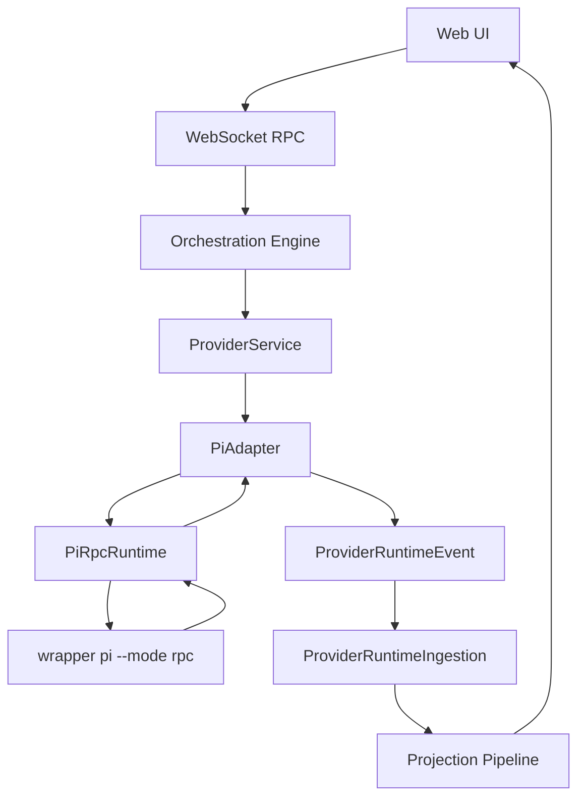

# Plan: Pi Agent Integration via Wrapper RPC

## Decision

Use the installed/wrapper `pi` CLI in RPC mode as the first integration path.

This means T3 Code starts `pi --mode rpc` as a child process, sends JSONL commands on stdin, reads JSONL responses/events from stdout, and maps Pi events into T3 Code `ProviderRuntimeEvent` shapes.

Do not embed upstream Pi SDK directly in the first slice.

Local development note: `/home/coder/.local/bin/pi` is now a thin source wrapper for `/home/coder/dotai/agent/src/cli.ts` using that repo's `node_modules/.bin/tsx`. The old Bun global `@shekohex/agent` package was removed, so PATH `pi` in this environment runs wrapper source directly. Building `/home/coder/dotai/agent` is still useful verification, but is not required for PATH `pi` to pick up source edits.

## Why CLI/RPC First

The wrapper at `~/dotai/agent` matters. Its CLI startup path does more than call upstream Pi:

1. Installs bundled resource path patches.
2. Handles wrapper update commands.
3. Ensures wrapper runtime default settings.
4. Calls upstream `main(args, { extensionFactories: bundledExtensionFactories })`.

Direct SDK use would bypass that boot path unless T3 Code depends on a new wrapper SDK export that recreates it exactly.

RPC gives the right ownership boundary:

1. T3 owns child process lifecycle.
2. Pi owns its settings, auth, extensions, skills, prompts, patches, and sessions.
3. Wrapper behavior matches normal terminal `pi` behavior.
4. Extension defects stay isolated from the T3 server process.
5. Version skew is easier to manage because the process boundary is JSONL.

## Architecture Target



## Runtime Shape

Add `apps/server/src/provider/piRpcRuntime.ts`.

Responsibilities:

1. Spawn wrapper CLI via configured `binaryPath`, default `pi`.
2. Pass `--mode rpc`.
3. Pass `--provider`, `--model`, `--thinking`, `--session`, `--session-dir`, `--no-session`, `--tools`, `--exclude-tools`, `--approve`, `--no-approve`, and extra launch args as needed.
4. Set env, including `PI_CODING_AGENT_DIR` when `agentDir` is configured.
5. Read stdout with strict LF JSONL framing, not Node `readline`.
6. Correlate command responses by `id`.
7. Publish uncorrelated events to an Effect queue.
8. Capture stderr for diagnostics and provider status messages.
9. Kill the child process on scope close with graceful then force kill.
10. Surface process exit as `session.exited` / `runtime.error` through adapter.

## Provider Settings

Add `PiAgentSettings` to `packages/contracts/src/settings.ts`.

Fields:

1. `enabled`: boolean, default `true`.
2. `binaryPath`: string, default `pi`.
3. `agentDir`: string, optional, maps to `PI_CODING_AGENT_DIR`.
4. `sessionDir`: string, optional, maps to `--session-dir`.
5. `launchArgs`: string, optional escape hatch for advanced CLI flags.
6. `projectTrust`: `default | approve | no-approve`, maps to no flag / `--approve` / `--no-approve`.
7. `customModels`: string array.

Register driver kind `piAgent`.

Add web settings metadata to `apps/web/src/components/settings/providerDriverMeta.ts`. `PiAgentIcon` already exists and is currently in the coming-soon list.

## Session Lifecycle

Long-lived T3 chat threads should use persistent Pi sessions.

Start flow:

1. Resolve cwd from T3 thread/project.
2. Resolve model selection into Pi `provider/model[:thinking]` or `--provider` + `--model` + `--thinking`.
3. Resolve tools from `runtimeMode` and approval policy.
4. Spawn `pi --mode rpc`.
5. If resuming, pass `--session <sessionFileOrId>` from `resumeCursor`.
6. Call `get_state` after startup.
7. Store `sessionFile`, `sessionId`, cwd, tool mode, and model in `resumeCursor` / runtime payload.
8. Emit `session.started` and `session.state.changed`.

Resume cursor shape:

```ts
interface PiResumeCursor {
  readonly version: 1;
  readonly sessionFile?: string;
  readonly sessionId?: string;
  readonly cwd?: string;
}
```

Stop flow:

1. Send `abort` when running.
2. Close process scope.
3. Emit `session.exited`.

## One-Shot Sessions

Use `--no-session` for non-chat one-shot work.

Good candidates:

1. Commit message generation.
2. PR title/body generation.
3. Branch name generation.
4. Thread title generation.
5. Provider status probes that only need model inventory or auth signal.

Long-lived T3 chat sessions should not use `--no-session` because we want Pi tree navigation, continuation, and session files.

## Tools And Permissions

Map T3 runtime/tool modes to Pi CLI startup flags.

Initial mapping:

1. Full access: default Pi tools, optionally `--approve` when configured.
2. Read-only/restricted: `--tools read,grep,find,ls` and `--no-approve` by default.
3. No tools: `--no-tools`.
4. Custom tool profiles: `--tools <list>` plus `--exclude-tools <list>`.

Pi can change active tools through Extension API, but public RPC currently has no `set_active_tools` command. First implementation can restart the Pi RPC process with a different `--tools` set while preserving the same `--session`.

Restart rule:

1. Only restart when idle or after `abort` completes.
2. Persist current `sessionFile` from `get_state` before closing.
3. Spawn new process with updated tool flags and `--session <sessionFile>`.
4. Rebind event subscriptions.

Future improvement: add wrapper bridge or upstream RPC command `set_active_tools` so restarts are not needed for tool-mode changes.

## Sending Turns

When idle:

1. Send `prompt` with message text and images.
2. Record returned command acceptance.
3. Emit `turn.started` on `agent_start` or first turn event.

When already running:

1. Use `steer` for T3 steering behavior.
2. Use `follow_up` for queued follow-up behavior.
3. Use `prompt` with `streamingBehavior` only when wrapper command behavior needs template/extension command handling.

Interrupt:

1. Send `abort`.
2. Map Pi abort/error event to `turn.aborted` or `turn.completed` with interrupted/cancelled state, depending on emitted event.

## Event Mapping

Map Pi RPC events to canonical T3 runtime events.

| Pi RPC event | T3 runtime event |
| --- | --- |
| `agent_start` | `turn.started` |
| `turn_start` | `turn.started` if not already emitted |
| `message_update.text_delta` | `content.delta` with `assistant_text` |
| `message_update.thinking_delta` | `content.delta` with `reasoning_text` |
| `message_update.toolcall_*` | optional `item.started` / `item.updated` for tool call args |
| `tool_execution_start` | `item.started` |
| `tool_execution_update` | `item.updated` |
| `tool_execution_end` | `item.completed` |
| `queue_update` | `runtime.warning` or future queue projection event |
| `auto_retry_start` / `auto_retry_end` | `runtime.warning` / `runtime.error` when final |
| `extension_error` | `runtime.error` |
| `agent_end` or `turn_end` | `turn.completed` |
| process exit | `session.exited` |

Raw events should be attached with a new raw source such as `pi.rpc.event`.

## Wrapper Bridge Strategy

Use one small generic upstream Pi RPC patch for extension-event transport. Produce that as a new upstream patch artifact, then make the wrapper consume it cleanly. Do not add T3-specific upstream RPC commands and do not hand-edit `node_modules`.

Smoke result from `/home/coder/dotai/agent/src/extensions/t3-rpc-smoke.ts` loaded with `pi --mode rpc --no-session --no-tools --no-extensions --extension ...`:

1. Raw `pi.events.emit(...)` is internal extension-bus traffic and is not forwarded to RPC stdout by itself.
2. `process.stdout.write(...)` and `console.log(...)` are redirected to stderr in RPC mode by `takeOverStdout()`.
3. `fs.writeSync(1, jsonl)` reaches RPC stdout, but bypasses Pi's `writeRawStdout` queue/backpressure and can interleave under load. Use only as proof, not production bridge.
4. `ctx.ui.notify(...)` appears as `extension_ui_request` in RPC and does not touch conversation state, but using UI methods as a control plane is too indirect for core T3 integration.
5. `pi.sendMessage({ customType, content, details }, { triggerTurn: false })` appears as `message_start` / `message_end`, but it appends to session/agent state. Do not use it for T3 control-plane responses.
6. Client-to-extension requests can be invoked without new upstream RPC commands by sending an RPC `prompt` containing a registered slash command, for example `/t3-rpc-smoke hello-from-rpc`, but this is still command-path coupling.

Stable target: add one generic upstream-supported extension event transport to RPC mode as a new upstream patch, rather than many bespoke RPC commands.

Recommended shape:

1. RPC stdout event: `{ "type": "extension_event", "channel": string, "payload": unknown }`, emitted through the same `writeRawStdout` queue as native RPC events.
2. RPC stdin command: `{ "id": string, "type": "extension_event", "channel": string, "payload": unknown }`, which emits into the extension event bus and returns an ack/error response.
3. Wrapper extensions can then use `pi.events.emit("t3:rpc:response", payload)` and `pi.events.on("t3:rpc:request", handler)` without touching conversation state or UI.
4. T3 correlates by request id inside payload.

Do not ship slash-command requests plus `fs.writeSync(1, jsonl)` except as a throwaway diagnostic prototype gated to `ctx.mode === "rpc"` with explicit interleaving-risk notes.

## User Input And Custom UI

Pi RPC already supports generic extension UI requests:

1. `select`.
2. `confirm`.
3. `input`.
4. `editor`.
5. `notify`.
6. `setStatus`.
7. `setWidget`.
8. `setTitle`.
9. `set_editor_text`.

T3 should map these to `request.opened`, `user-input.requested`, or fire-and-forget UI notifications.

Responses go back as `extension_ui_response`.

## `ask_user_question` Support

Current wrapper implementation uses `ctx.ui.custom(...)` for the rich questionnaire overlay.

Upstream RPC mode currently makes `ctx.ui.custom()` return `undefined`, so `ask_user_question` would cancel/fail under plain RPC.

Required wrapper change:

1. Detect RPC/non-custom UI mode inside `ask_user_question`.
2. For basic support, fall back to existing `ctx.ui.select`, `ctx.ui.input`, and `ctx.ui.editor` requests.
3. Preserve existing prompt/answered/cancelled events internally.
4. Return the same tool result envelope as TUI mode.

Basic fallback behavior:

1. Single-select question: send `select` with authored options plus sentinel rows.
2. Multi-select question: use repeated `select` or `editor`/`input` fallback until richer protocol exists.
3. Free-text/screenshot question: use `input` or `editor` and include Glance upload URL in prompt text.
4. Preview-rich question: use `editor` or rich custom event fallback because plain `select` cannot render previews.

Rich protocol improvement:

1. Prefer generic `extension_event` transport that emits structured `askUserQuestion` payloads without touching conversation state.
2. Payload should carry full questions, options, descriptions, previews, multi-select flags, screenshot request metadata, and Glance upload URL.
3. T3 renders native questionnaire UI and replies with structured answers.
4. Wrapper translates reply back into the existing `QuestionnaireResult` and tool result envelope.

Alternative rich protocol:

1. Use generic `extension_event` JSONL events for wrapper/T3 messages.
2. Add stdin `extension_event` command for T3-to-wrapper replies.
3. Use that bridge for `ask_user_question`, notifications, workflow progress, and future custom UI.

Recommendation:

1. Implement basic fallback first so the tool works.
2. Add rich `askUserQuestion` RPC method next for proper T3 rendering.
3. Add generic extension-event forwarding only if more wrapper extensions need custom UI/state streaming.

## Tree Navigation And Rollback

Pi sessions are append-only JSONL trees. Entries have `id` and `parentId`. In-place tree navigation is handled by `AgentSession.navigateTree(targetId, options)`.

RPC already exposes:

1. `fork`.
2. `clone`.
3. `switch_session`.
4. `get_fork_messages`.

RPC command context for extensions exposes `navigateTree(...)`, but public stdin RPC does not currently list `navigate_tree` or `get_tree` commands.

Required wrapper additions, preferably over generic `extension_event` transport:

1. `t3:get-tree`: returns sanitized `ctx.sessionManager.getTree()` data or flat entries with id, parentId, type, role, text preview, timestamp, label.
2. `t3:navigate-tree`: calls `ctx.navigateTree(targetId, { summarize, customInstructions, replaceInstructions, label })`.
3. `t3:get-current-leaf`: optional helper returning active leaf id.

T3 adapter `readThread` strategy:

1. Use `get_messages` for current active branch messages.
2. Use `get_tree` for full branch-aware UI and rollback target selection.

T3 adapter `rollbackThread(numTurns)` strategy:

1. Compute target id from `get_tree`/active branch.
2. Call `navigate_tree` to move leaf in-place.
3. Emit canonical rollback/read snapshot based on `get_messages` after navigation.

Until bridge tree commands exist, implement rollback as unsupported for Pi or approximate with `fork`/`clone` only when the UX explicitly wants a new session file.

## Provider Snapshot And Models

Provider status probe:

1. Run `pi --version` to detect install/version.
2. Spawn `pi --mode rpc --no-session --no-tools` with configured env/agentDir.
3. Send `get_available_models`.
4. Flatten returned Pi `Model` objects into T3 `ServerProviderModel` rows.
5. Add custom models from settings.
6. Mark auth as `authenticated` when models are available, otherwise `unknown` or `unauthenticated` based on error text.

Model slug convention:

1. Use `provider/modelId` when Pi model exposes separate provider and id.
2. Preserve thinking level as a T3 model option descriptor when available.
3. Accept manual custom model slugs using the same convention.

## Text Generation

Use one-shot Pi RPC processes first.

Flow:

1. Spawn `pi --mode rpc --no-session --no-tools` or a narrow read-only tool set.
2. Set requested model and thinking level.
3. Send prompt that asks for strict JSON.
4. Wait for `agent_end`.
5. Read `get_last_assistant_text`.
6. Parse JSON with existing T3 text-generation decoders.
7. Kill process.

Later optimization:

1. Keep a small idle pool of one-shot RPC processes per model/tool profile.
2. Or add a wrapper SDK export if direct in-process generation becomes necessary.

## Implementation Phases

### Phase 0: Wrapper RPC Readiness

1. Add generic `extension_event` transport or a short-lived prototype proving it.
2. Add wrapper extension handlers for `get_tree` and `navigate_tree` over that transport.
3. Add `ask_user_question` RPC fallback or rich `askUserQuestion` bridge payloads.
4. Add tests in `~/dotai/agent` for RPC fallback and tree commands.

### Phase 1: T3 Contracts And Settings

1. Add `PiAgentSettings` schema and patch schema.
2. Add driver kind metadata/default model entries.
3. Add `pi.rpc.event` raw source to provider runtime contracts.
4. Add Pi client definition and move Pi Agent out of coming-soon UI.

### Phase 2: Server Runtime And Driver

1. Implement `PiRpcRuntime` service.
2. Implement `PiDriver`.
3. Add `PiDriver` to `BUILT_IN_DRIVERS`.
4. Add runtime layer dependencies.
5. Add provider snapshot probe.

### Phase 3: Adapter

1. Implement `makePiAdapter` with per-thread sessions.
2. Implement start/send/interrupt/respond/stop/list/has/read/rollback.
3. Map RPC events into `ProviderRuntimeEvent`.
4. Persist `PiResumeCursor`.
5. Handle process exits and restarts.

### Phase 4: Text Generation

1. Implement `makePiTextGeneration` using one-shot `--no-session` RPC.
2. Add JSON extraction and existing text-generation sanitizers.
3. Add tests for commit, PR, branch, and thread-title prompts with mocked runtime.

### Phase 5: Rich UI Polish

1. Render generic `extension_ui_request` in T3 approval/user-input UI.
2. Render rich `ask_user_question` natively when available.
3. Display Pi queue updates and extension notifications.
4. Add tree navigation/rollback UI affordances if needed.

## Test Plan

Wrapper tests:

1. RPC `ask_user_question` fallback returns valid tool result.
2. RPC `get_tree` returns stable ids/parents.
3. RPC `navigate_tree` moves active branch and preserves session file.
4. RPC rich questionnaire request round-trips when enabled.

T3 server tests:

1. Strict JSONL parser handles split chunks and multiple records.
2. Runtime correlates responses and streams events concurrently.
3. Runtime kills process on scope close.
4. Adapter maps text, reasoning, tools, extension UI, errors, and completion.
5. Tool-mode restart preserves session cursor.
6. Provider status reports missing binary, no auth, and model inventory cases.
7. Text generation uses `--no-session` and parses strict JSON.

T3 web tests:

1. Pi appears in provider settings.
2. Pi models appear in model picker.
3. Generic extension UI requests render and respond.
4. Rich `ask_user_question` renders when supported.

Repository verification:

1. `vp check`.
2. `vp run typecheck`.

## Risks

1. RPC schema drift: pin wrapper version and keep runtime decode tolerant.
2. Rich UI gap: basic `select/input/editor` fallback works first; native questionnaire comes next.
3. Tool profile restarts during active turns: only restart when idle or after abort.
4. Auth UX: initial version can require user to run `pi /login` externally; later T3 can expose auth helpers.
5. Project trust: non-interactive mode cannot prompt; expose `projectTrust` setting explicitly.
6. Session directory compatibility: use Pi-owned session files and store only opaque cursor in T3.
7. MCP integration: defer until we know whether wrapper extension or CLI config is the cleanest bridge.

## Current Recommendation

Proceed with wrapper CLI/RPC.

The CLI path is now stronger than SDK for this integration because:

1. `--no-session` covers one-shot tasks cleanly.
2. `--tools`/`--exclude-tools` cover first-pass permissions.
3. Session restarts can apply new tool profiles while preserving `--session`.
4. Pi tree sessions can support rollback once `get_tree`/`navigate_tree` are exposed.
5. Generic RPC extension UI covers simple questions today.
6. Wrapper can add `ask_user_question` RPC fallback/rich method without changing T3 provider architecture.

## 2026-06-19 UI/Streaming Findings

Current implementation status:

1. Upstream Pi `extension_event` source patch exists in `/home/coder/.cache/checkouts/github.com/earendil-works/pi/packages/coding-agent` and passes targeted `packages/coding-agent` RPC test.
2. Wrapper consumes that behavior through `patches/@earendil-works+pi-coding-agent+0.79.6.patch`; PATH `pi` smoke test confirms `t3:get-tree` responses over `extension_event`.
3. Wrapper `t3-rpc-bridge` exposes `t3:get-tree`, `t3:get-current-leaf`, and `t3:navigate-tree`.
4. Wrapper `ask_user_question` no longer fails under RPC; it falls back to `select`, `input`, and `editor`.
5. T3 `piAgent` provider, settings, model probe, model picker metadata, registry integration, runtime, adapter, and one-shot text generation are implemented.
6. T3 provider snapshot works with both `pi` and `/home/coder/.local/bin/pi` and returns live model inventory.

Observed UI bugs from screenshots:

1. Assistant text streaming is broken because Pi `message_update` mapping treats any `assistantMessageEvent.delta` as assistant text.
2. Pi `AssistantMessageEvent` includes `toolcall_delta`; those deltas are streamed JSON tool-call argument fragments, not assistant text.
3. T3 is rendering those `toolcall_delta` JSON fragments as assistant markdown, causing raw `{"path":...}` output and bad paragraph wrapping.
4. Pi `text_delta` and `thinking_delta` should map to `content.delta`; `toolcall_delta` must not map to assistant text.
5. Pi text deltas also need stable assistant `itemId`s. Current mapping omits `itemId`, so T3 ingestion falls back to event/turn heuristics instead of normal assistant segment identity used by Claude/Cursor/ACP.
6. Pi tool execution cards are too raw because `tool_execution_*` maps every event to `data: rawEvent` with weak `title` and no normalized `detail`.
7. Pi tools overlap normal T3 tool categories: `bash`/shell → `command_execution`; `edit`, `write`, `apply_patch` → `file_change`; `read`, `find`, `grep`, `ls` are read/search/file tools and should still render as first-class dynamic/tool cards with useful detail.
8. Custom Pi tools should stay supported as `dynamic_tool_call` with `data: { toolName, input, partialResult/result }`, not raw top-level event JSON.

Important implementation reference points:

1. Claude adapter creates assistant text blocks with stable item ids via `ensureAssistantTextBlock`, emits `content.delta` with `itemId`, and completes blocks separately.
2. Claude adapter streams tool input JSON deltas into `item.updated` with parsed input summaries, not assistant text.
3. OpenCode adapter maps tool parts to `item.started` / `item.updated` / `item.completed` and sets `detail` from title/output/error plus `data: { tool, state }`.
4. ACP/Cursor runtime emits assistant item lifecycle and content deltas with shared `itemId`, allowing T3 ingestion to append streaming text to same message.
5. ProviderRuntimeIngestion groups assistant deltas by `itemId`/turn segment state; wrong or missing `itemId` can fragment rendering.

Next Pi adapter slice:

1. In `apps/server/src/provider/Layers/PiAdapter.ts`, track assistant text content indexes per active turn/message.
2. Map Pi `message_update.assistantMessageEvent.type` exactly:
   - `text_start`: emit `item.started` with `itemType: "assistant_message"` and stable `itemId` for that `contentIndex`.
   - `text_delta`: emit `content.delta` with `streamKind: "assistant_text"` and same `itemId`.
   - `text_end` / `done` / `message_end`: emit `item.completed` for open assistant text item(s).
   - `thinking_delta`: emit `content.delta` with `streamKind: "reasoning_text"`; use stable reasoning item id if needed.
   - `toolcall_start`: emit `item.started` for the tool call with stable `itemId` from partial/final tool call id when available, otherwise `contentIndex` scoped to active turn.
   - `toolcall_delta`: buffer/parse JSON args and emit `item.updated`, never assistant text.
   - `toolcall_end`: emit final `item.updated` with parsed args; execution completion still comes from `tool_execution_end`.
3. Normalize Pi tool names with a classifier matching Claude/OpenCode conventions:
   - shell/bash/command/terminal → `command_execution`.
   - edit/write/patch/apply_patch/create/delete/replace → `file_change`.
   - web/websearch/search-web → `web_search`.
   - mcp → `mcp_tool_call`.
   - image/view-image → `image_view`.
   - agent/subagent/task → `collab_agent_tool_call`.
   - everything else → `dynamic_tool_call`.
4. Add `detail` summaries for known Pi tool args:
   - `bash`: command string.
   - `read`: path plus optional offset/limit.
   - `write`/`edit`/`apply_patch`: path/patch summary.
   - `find`/`grep`/`ls`: pattern/path summary.
5. Use structured payloads: `data: { toolName, input, partialResult?, result?, isError? }`.
6. Emit `content.delta` for command/file output when Pi `tool_execution_update.partialResult` or `tool_execution_end.result` contains text output, using `streamKind: "command_output"` or `"file_change_output"` and same tool `itemId`.
7. Add targeted tests near Pi adapter/runtime mapping before broad validation.

Validation state:

1. `vp check` passes with existing unrelated lint warnings.
2. `vp run typecheck` passes.
3. Wrapper `npm run typecheck`, `npm run test`, and `npm run build` pass.
4. Upstream `cd packages/coding-agent && npm test -- test/rpc-extension-event.test.ts` passes.
5. Full T3 `vp test` still fails unrelated to Pi: Electron package install failure in desktop suites and `GitVcsDriverCore.test.ts` temp ssh-env file ENOENT.
6. Pi RPC `follow_up` is intentionally not wired in this slice because T3 `ProviderAdapterShape` / `ProviderSendTurnInput` has no queued-follow-up API. Current mapping is: idle `sendTurn` → Pi `prompt`; active `sendTurn` → Pi `steer`.
7. PATH/explicit wrapper smoke tests pass: `get_available_models`, `t3:get-tree`, `t3:navigate-tree`, and `--no-session --no-tools` prompt returning `{"ok":true}`.
