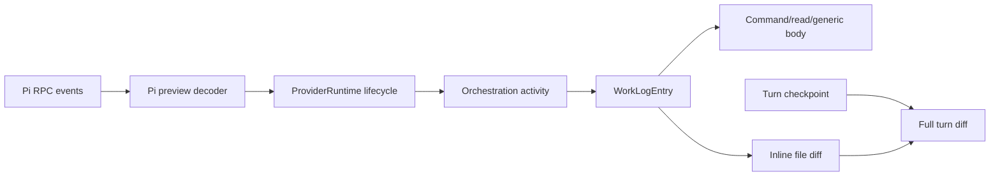

# Pi Tool-Call Preview Parity

> Implementation handoff. Re-read referenced files before editing. Keep changes surgical. Upstream Pi and local wrapper paths below are read-only evidence.

**Status:** Implemented  
**Priority:** P1  
**Effort:** L for recommended milestone; XL with optional live updates  
**Created:** 2026-07-11

## Why

Pi already sends enough structured tool data for rich completed previews, including command output, read content, native edit patches, and wrapper `apply_patch` unified diffs. T3 persists much of that raw data but reduces it to generic text rows in web.

Target semantic parity:

- One stable row per active, completed, or failed tool call.
- Bounded command, read, search, and generic output previews.
- Inline unified diffs for native `edit` and wrapper `apply_patch`.
- Full turn-level checkpoint diff remains authoritative post-turn view.
- No unbounded raw inputs/results or wrapper `before`/`after` file copies in thread snapshots.

## Evidence

### Pi protocol

Upstream Pi RPC forwards session events unchanged in `/home/coder/.cache/checkouts/github.com/earendil-works/pi/packages/coding-agent/src/modes/rpc/rpc-mode.ts:354-356`.

Tool events expose generic structured args/results in `/home/coder/.cache/checkouts/github.com/earendil-works/pi/packages/coding-agent/src/core/extensions/types.ts:749-770`:

```ts
type PiToolExecutionEvent =
  | { type: "tool_execution_start"; toolCallId: string; toolName: string; args: unknown }
  | {
      type: "tool_execution_update";
      toolCallId: string;
      toolName: string;
      args: unknown;
      partialResult: unknown;
    }
  | {
      type: "tool_execution_end";
      toolCallId: string;
      toolName: string;
      result: unknown;
      isError: boolean;
    };
```

Pi `renderCall` and `renderResult` callbacks return terminal UI `Component` objects in `/home/coder/.cache/checkouts/github.com/earendil-works/pi/packages/coding-agent/src/core/extensions/types.ts:437-483`. They are not RPC payloads. T3 must render web UI from data, not invoke or tunnel Pi TUI renderers.

### Edit data already exists

Upstream Pi native `edit` declares display diff plus unified patch in `/home/coder/.cache/checkouts/github.com/earendil-works/pi/packages/coding-agent/src/core/tools/edit.ts:61-67` and returns it at `edit.ts:350-360`:

```ts
interface EditToolDetails {
  diff: string;
  patch: string;
  firstChangedLine?: number;
}
```

Local wrapper `apply_patch` declares aggregate unified diff and per-file metadata in `/home/coder/dotai/agent/src/extensions/patch/types.ts:43-49` and returns it at `execution.ts:46-65`:

```ts
type ApplyPatchDetails = {
  diff: string;
  files: PatchFileDetails[];
  targets: PatchTargetDetails[];
  totalFiles: number;
  completedFiles: number;
};
```

Each wrapper file also includes `diff`, `before`, and `after` in `/home/coder/dotai/agent/src/extensions/patch/types.ts:24-49`. Persisting raw result duplicates full files and cannot be preview architecture.

### T3 data loss

`apps/server/src/provider/Layers/PiAdapter.ts:590-623` classifies broad item types. Read remains `dynamic_tool_call`.

`apps/server/src/provider/Layers/PiAdapter.ts:1192-1228` stores raw `input`, `partialResult`, and `result` under `payload.data`. `detail` is truncated summary text. `apps/server/src/provider/Layers/PiAdapter.ts:1355-1427` emits start/completion events; update events only become command/file output text deltas.

`apps/server/src/orchestration/Layers/ProviderRuntimeIngestion.ts:583-647` preserves update status/data, but start drops status and all structured fields, while completion drops status. Restoring bounded canonical fields is required; restoring arbitrary start `data` is not.

`apps/server/src/orchestration/Layers/ProviderRuntimeIngestion.ts:490-496` drops non-reasoning `content.delta` values from activity projection, so Pi command/file output deltas do not reach current work-log UI.

`apps/web/src/session-logic.ts:632-648` drops every `tool.started` activity. `apps/web/src/session-logic.ts:682-750` only retains rich `toolData` for MCP. `apps/web/src/session-logic.ts:1249-1301` does not traverse wrapper `result.details`.

`apps/web/src/components/chat/MessagesTimeline.tsx:1799-1850` creates plain-text expanded bodies. `apps/web/src/components/chat/MessagesTimeline.tsx:1910-2057` uses one generic row for every tool kind.

### Codex and checkpoint difference

Codex preserves item notifications in `apps/server/src/provider/Layers/CodexAdapter.ts:451-486` and emits provider-native `turn.diff.updated` in `apps/server/src/provider/Layers/CodexAdapter.ts:813-826`.

Pi has no equivalent turn-diff RPC event. T3 git checkpoints remain provider-independent full-turn diffs.

`apps/server/src/orchestration/Layers/CheckpointReactor.ts:294-310` currently fabricates `assistant:${turnId}` when no real assistant message is visible during capture. Web indexes only non-null message IDs in `apps/web/src/components/ChatView.tsx:2066-2074`. Fabricated IDs cannot match Pi's actual assistant message, so valid checkpoint diffs may not appear below it.

## Decision

Add optional provider-independent, typed, bounded `ToolCallPreview` to item lifecycle payloads.

Provider adapter decodes raw shape. Orchestration preserves typed value. Web renders by preview kind.



Do not:

- Serialize terminal components, ANSI UI, HTML, or Markdown from Pi.
- Parse provider-native Pi result shapes in React.
- Add `provider === "pi"` rendering branches.
- Persist unbounded `input`, `result`, `partialResult`, `before`, `after`, or `patchText`.
- Replace authoritative checkpoint diffs with tool-local diffs.

## Contract

Add `packages/contracts/src/toolCallPreview.ts`, export it from `packages/contracts/src/index.ts`, and add optional canonical tool identity plus preview fields to `ItemLifecyclePayload` in `packages/contracts/src/providerRuntime.ts`:

```ts
toolCallId: Schema.optional(TrimmedNonEmptyString);
toolName: Schema.optional(ToolName);
toolPreview: Schema.optional(ToolCallPreview);
```

Define `ToolName` with 256-character maximum and tool-call ID with a conservative bounded schema. Keep provider-native details in `data`, not canonical identity.

Expected shape:

```ts
type ToolCallPreview =
  | {
      kind: "command";
      command: string;
      commandTruncated?: boolean;
      cwd?: string;
      output?: string;
      outputTruncated?: boolean;
      exitCode?: number;
    }
  | {
      kind: "read";
      path: string;
      offset?: number;
      limit?: number;
      content?: string;
      contentTruncated?: boolean;
    }
  | {
      kind: "file_change";
      files: ReadonlyArray<{
        path: string;
        sourcePath?: string;
        changeKind: "add" | "update" | "delete" | "move" | "unknown";
        additions?: number;
        deletions?: number;
      }>;
      unifiedDiff?: string;
      diffTruncated?: boolean;
      filesTruncated?: boolean;
      output?: string;
      outputTruncated?: boolean;
      completedFiles?: number;
      totalFiles?: number;
    }
  | {
      kind: "search";
      query?: string;
      queryTruncated?: boolean;
      path?: string;
      output?: string;
      outputTruncated?: boolean;
    }
  | {
      kind: "generic";
      toolName: string;
      input?: string;
      output?: string;
      inputTruncated?: boolean;
      outputTruncated?: boolean;
    };
```

Required bounds:

| Value                                          |                    Limit | Strategy                                                        |
| ---------------------------------------------- | -----------------------: | --------------------------------------------------------------- |
| Command/read/search/file-change/generic output | 32,000 UTF-16 code units | Head/tail split; marker included in limit                       |
| Command/query/generic serialized input         | 16,000 UTF-16 code units | Even head/tail split; marker included in limit                  |
| Complete unified diff                          | 64,000 UTF-16 code units | Keep only when complete; otherwise omit and set `diffTruncated` |
| File metadata                                  |                 50 files | First 25 plus last 25                                           |
| Tool names                                     |           256 code units | Reject malformed value and use safe fallback                    |
| Tool-call IDs                                  |           512 code units | Replace over-limit provider ID with deterministic bounded hash  |
| Paths/cwd                                      |         1,024 code units | Reject malformed value; never display a silently altered path   |

Use one deterministic marker such as `\n… preview truncated …\n`. Marker counts toward text limits. For 32,000-character output, allocate 3/8 of remaining capacity to head and 5/8 to tail. For command, query, and generic input, split remaining capacity evenly. Never split surrogate pairs.

For an over-limit provider tool-call ID, emit a stable `tool:<sha256>` canonical ID so start/completion correlation survives without persisting malformed identity.

Never slice unified patch text into an invalid patch. If complete patch exceeds 64,000 characters, omit `unifiedDiff`, set `diffTruncated: true`, retain bounded file metadata/output summary, and link to full turn checkpoint diff.

Put bounds and pure helpers in `packages/shared/src/toolActivity.ts` unless that module becomes unfocused; only then split a new explicit shared subpath.

Keep `data?: unknown` for other providers. Pi should stop placing known bulky tool payloads there after decoder completion.

## Scope

### Recommended milestone

- Typed preview contract.
- Pi decoding for `bash`, `read`, native `edit`, wrapper `apply_patch`, write/delete/move, search aliases, and unknown tools.
- Bounded persisted payloads.
- Active/completed/failed lifecycle rows collapsed by tool call ID.
- Inline text and file-diff bodies.
- Link to full turn diff.
- Reliable turn-diff attachment by turn ID fallback.
- Unit, ingestion, projection, component, payload-size, and checkpoint tests.

### Out of scope

- Exact Pi TUI layout/colors.
- ANSI interpretation or terminal emulation.
- Read-output syntax highlighting.
- Mobile preview UI.
- Migration of Codex/OpenCode/Cursor/Claude adapters.
- Existing activity backfill.
- Persisting every command output update.

### Optional milestone

- Progressive wrapper `apply_patch` updates.
- Incremental command output in row.

Do not implement optional work until payload/event measurements prove durable snapshot growth acceptable.

## Commands

```bash
# Baseline
vp test run apps/server/src/provider/Layers/PiAdapter.test.ts
vp test run apps/server/src/orchestration/Layers/ProviderRuntimeIngestion.test.ts
vp test run apps/server/src/orchestration/Layers/CheckpointReactor.test.ts
vp test run apps/web/src/session-logic.test.ts
vp test run apps/web/src/components/chat/MessagesTimeline.test.tsx
vp test run apps/web/src/components/chat/MessagesTimeline.logic.test.ts

# Intermediate
vp run --filter @t3tools/contracts typecheck
vp run --filter @t3tools/shared typecheck
vp run --filter t3 typecheck
vp run --filter @t3tools/web typecheck

# Required final gates
vp check
vp run typecheck
```

Use `vp test`, not raw `vitest`. No native mobile changes planned, so `vp run lint:mobile` is unnecessary unless scope expands into `apps/mobile`.

## Git Workflow

Suggested branch: `feat/pi-tool-call-previews`

Suggested commits:

1. `feat(contracts): add bounded tool call previews`
2. `feat(server): normalize pi tool previews`
3. `feat(web): render structured tool call previews`
4. `fix(web): attach turn diffs by turn fallback`

Before each commit:

```bash
git status --short
git diff --check
```

Stage only files for that commit. Preserve concurrent unrelated worktree changes.

## Steps

### 1. Lock real event fixtures

**Files:**

- `apps/server/src/provider/Layers/PiAdapter.test.ts`
- Upstream/native sources listed under Evidence, read-only

Add inline fixtures matching actual Pi event shapes for:

- Bash start/end with multiline output and failed end text containing Pi's trailing `Command exited with code N` status.
- Read start/end with path, offset, limit, and text content.
- Native edit end with `details.diff`, `details.patch`, and `firstChangedLine`.
- Wrapper apply-patch end with aggregate `details.diff`, `files`, `targets`, totals, plus sentinel `before`/`after` content.
- Failed command result.
- Unknown custom tool input/output.

Representative wrapper fixture:

```ts
const piApplyPatchEnd = {
  type: "tool_execution_end",
  toolCallId: "tool-patch-1",
  toolName: "apply_patch",
  result: {
    content: [{ type: "text", text: "Updated src/value.ts" }],
    details: {
      diff: "diff --git a/src/value.ts b/src/value.ts\n...",
      files: [
        {
          relativePath: "src/value.ts",
          type: "update",
          diff: "...",
          before: "FULL_OLD_FILE_SENTINEL",
          after: "FULL_NEW_FILE_SENTINEL",
          additions: 1,
          deletions: 1,
        },
      ],
      targets: [{ relativePath: "src/value.ts", type: "update" }],
      totalFiles: 1,
      completedFiles: 1,
    },
  },
  isError: false,
};
```

Verify baseline before production edits. If baseline already fails, stop and record exact failure under Maintenance Notes.

### 2. Add contract and bounds

**Files:**

- `packages/contracts/src/toolCallPreview.ts` new
- `packages/contracts/src/toolCallPreview.test.ts` new
- `packages/contracts/src/providerRuntime.ts`
- `packages/contracts/src/index.ts`
- `packages/shared/src/toolActivity.ts`
- `packages/shared/src/toolActivity.test.ts`

Implement Effect Schema discriminated variants and optional lifecycle fields:

```ts
toolCallId: Schema.optional(TrimmedNonEmptyString);
toolName: Schema.optional(ToolName);
toolPreview: Schema.optional(ToolCallPreview);
```

Add pure helpers for head/tail truncation, stable bounded JSON serialization, and bounded/deduplicated file metadata.

Extend existing `deriveToolActivityPresentation(...)` to accept canonical preview kind or preview data so `Ran command`, `Read file`, and `Changed files` headings remain shared with ACP normalization. Do not create a second independent title classifier in Pi decoder.

Tests must cover exact boundary, one-character overflow, empty values, surrogate pairs, circular JSON input, deterministic generic input ordering, invalid discriminants, negative counts, and schema limits.

Compatibility requirements:

- Existing provider events still decode.
- Existing clients ignore optional field.
- Existing `data` remains for non-Pi adapters.

Verify:

```bash
vp test run packages/contracts/src/toolCallPreview.test.ts packages/shared/src/toolActivity.test.ts
vp run --filter @t3tools/contracts typecheck
vp run --filter @t3tools/shared typecheck
```

### 3. Normalize Pi at adapter boundary

**Files:**

- `apps/server/src/provider/piToolCallPreview.ts` new
- `apps/server/src/provider/piToolCallPreview.test.ts` new
- `apps/server/src/provider/Layers/PiAdapter.ts`
- `apps/server/src/provider/Layers/PiAdapter.test.ts`

Create one focused pure provider decoder. Expected interface:

```ts
interface PiToolCallPreviewInput {
  toolName: string | undefined;
  args: Record<string, unknown> | undefined;
  result?: unknown;
  isError?: boolean;
}

interface PiToolCallProjection {
  itemType: ToolLifecycleItemType;
  toolCallId?: string;
  toolName?: string;
  title: string;
  detail?: string;
  toolPreview: ToolCallPreview;
  data?: Record<string, unknown>;
}
```

Mapping rules:

| Tool                       | Preview       | Sources                                                                              |
| -------------------------- | ------------- | ------------------------------------------------------------------------------------ |
| Bash/shell/command aliases | `command`     | args `command`/`cmd`, result text, provider exit metadata or Pi trailing exit status |
| Read aliases               | `read`        | args path/file/filePath, offset, limit, result text                                  |
| Native `edit`              | `file_change` | args path; prefer unified `result.details.patch`                                     |
| Wrapper `apply_patch`      | `file_change` | aggregate `result.details.diff`, compact `details.files`, `details.targets` fallback |
| Write/create/delete/move   | `file_change` | path metadata; never fabricate diff                                                  |
| Grep/find/search           | `search`      | query/pattern, path, bounded result text                                             |
| Unknown custom tool        | `generic`     | tool name, bounded stable JSON input/output                                          |

Rules:

- Use shared `deriveToolActivityPresentation(...)` for final title/detail after raw Pi data becomes canonical preview.
- Prefer native edit `details.patch`; `details.diff` is Pi display-oriented and not guaranteed unified.
- Prefer wrapper aggregate diff over per-file diff copies.
- Preserve move source/destination separately.
- Exclude wrapper `before`, `after`, `patchText`, and redundant per-file diff from compact persisted data.
- Keep bounded error output and explicit failed status.
- Do not infer success from missing exit code.
- Use relative paths when result metadata provides them.
- Set `diffTruncated` and omit `unifiedDiff` when a complete patch exceeds limit; never feed sliced patch text to `FileDiff`.

Change `toolPayload(...)` to set canonical `toolCallId`, `toolName`, and `toolPreview`. Do not duplicate identity or preview content under `data`. Replace raw Pi input/result persistence for recognized tools with no `data` unless a current consumer requires small provider-specific metadata. Unknown tools get bounded string previews, not raw objects. Raw native event logging, when enabled, remains debugging source.

Keep update behavior unchanged. Do not emit new durable `item.updated` events in recommended milestone.

Tests must prove command/read/edit/apply-patch/error/generic mappings, every bound, and absence of `FULL_OLD_FILE_SENTINEL`, `FULL_NEW_FILE_SENTINEL`, and `patchText` from serialized canonical event.

Verify:

```bash
vp test run apps/server/src/provider/piToolCallPreview.test.ts apps/server/src/provider/Layers/PiAdapter.test.ts
vp run --filter t3 typecheck
```

### 4. Preserve lifecycle fidelity

**Files:**

- `apps/server/src/orchestration/Layers/ProviderRuntimeIngestion.ts`
- `apps/server/src/orchestration/Layers/ProviderRuntimeIngestion.test.ts`

Preserve defined `title`, `status`, `toolCallId`, `toolName`, `detail`, and `toolPreview` on start, update, and completion activities. Keep existing detail truncation. Adapter/shared builder owns preview bounds.

Keep current raw `data` policy: updates and completions may preserve it for existing providers; starts must not begin persisting arbitrary provider-native `data`. Pi start rendering uses bounded canonical identity/preview fields instead.

Use stable start summary `event.payload.title ?? "Tool"`, not `${title} started`; lifecycle status already communicates progress and stable title avoids an active row heading ending in `started`.

Refactor repeated payload construction only if result remains clearer than three explicit branches.

Tests must prove:

- Start retains title, canonical tool identity, in-progress status, and preview with stable non-suffixed summary without raw provider data.
- Completion retains failed status.
- Update retains preview for future use.
- Existing MCP behavior remains unchanged.

Verify:

```bash
vp test run apps/server/src/orchestration/Layers/ProviderRuntimeIngestion.test.ts
vp run --filter t3 typecheck
```

### 5. Project one row per tool call

**Files:**

- `apps/web/src/session-logic.ts`
- `apps/web/src/session-logic.test.ts`
- `apps/web/src/components/chat/MessagesTimeline.logic.ts`
- `apps/web/src/components/chat/MessagesTimeline.logic.test.ts`

Add typed `toolPreview` to `WorkLogEntry` and `DerivedWorkLogEntry`. Read it and canonical `toolCallId`/`toolName` directly from activity payload. Fall back to legacy `payload.data.toolCallId` and provider-native title extraction for existing histories.

Include `tool.started` in work log. Collapse start/update/completion activities with same `(turnId, toolCallId)` even when parallel tool calls interleave. Preserve first-seen row position. Use an index map instead of only comparing previous entry.

Merge precedence:

```text
completed > latest update > started
```

Preserve earliest `createdAt` for ordering. When lifecycle began with canonical `tool.started`, preserve its row ID so expansion/state survives completion; otherwise retain existing latest-update ID behavior. Latest status/body wins. Merge `toolPreview` beside current `toolData` logic.

Use typed preview for command/path/changed-file summary before legacy heuristics. Keep heuristics as fallback for existing histories and other providers. Never branch on provider.

`deriveMessagesTimelineRows(...)` currently filters every neutral tool entry, which includes `inProgress`. Retain an in-progress entry only while its turn is the unsettled/running turn. Continue hiding orphaned start-only neutral entries after the turn settles.

Tests must cover active start-only row retention, settled orphan-start filtering, start/completion collapse, failed completion, file diff/path propagation, read content, unchanged MCP/Codex/OpenCode behavior, interleaved `start A`, `start B`, `complete A`, `complete B`, and no collapse across turns. Keep no-ID heuristic collapsing adjacent-only.

Verify:

```bash
vp test run apps/web/src/session-logic.test.ts apps/web/src/components/chat/MessagesTimeline.logic.test.ts
vp run --filter @t3tools/web typecheck
```

### 6. Render preview bodies

**Files:**

- `apps/web/src/components/chat/ToolCallPreviewBody.tsx` new
- `apps/web/src/components/chat/ToolCallPreviewBody.test.tsx` new
- `apps/web/src/components/chat/MessagesTimeline.tsx`
- `apps/web/src/components/chat/MessagesTimeline.test.tsx`
- `apps/web/src/lib/diffRendering.ts` reuse; edit only if a genuinely generic parser option is missing

Create provider-independent component:

```ts
interface ToolCallPreviewBodyProps {
  previewId: string;
  preview: ToolCallPreview;
  turnId: TurnId | null;
  canOpenTurnDiff: boolean;
  workspaceRoot?: string;
  resolvedTheme: "light" | "dark";
  onOpenTurnDiff: (turnId: TurnId, filePath?: string) => void;
}
```

Rendering matrix:

| Kind        | Collapsed                             | Expanded                                                        |
| ----------- | ------------------------------------- | --------------------------------------------------------------- |
| command     | `Ran command` plus command            | command block then output block                                 |
| read        | `Read file` plus path/range           | path header then plain-text content                             |
| file_change | `Changed files` plus first path/count | file list/output, lazy inline `FileDiff`, full-turn-diff action |
| search      | query/path                            | plain-text output                                               |
| generic     | tool name                             | bounded input/output sections                                   |

Update `workEntryIconName(...)` to prefer `toolPreview.kind`: command uses terminal, read uses eye, file change uses edit, search uses globe, generic falls back to existing item-type/tone logic. This fixes Pi `read`, which remains `dynamic_tool_call` at item-type level.

Parse `preview.unifiedDiff` with existing `getRenderablePatch(...)` from `apps/web/src/lib/diffRendering.ts`, using `tool-preview:${previewId}` as cache scope. For `kind: "files"`, map parsed `FileDiffMetadata` values into `FileDiff` from `@pierre/diffs/react` using existing `resolveFileDiffPath(...)` and `resolveDiffThemeName(...)` helpers. For `kind: "raw"`, render escaped raw patch text plus parser reason. Render parsing and diff components only after expansion.

Render full-turn-diff action only when `canOpenTurnDiff` is true and `turnId` exists. Derive this from `turnDiffSummaryByTurnId.get(turnId)?.status === "ready"` after step 7, not mere map presence because `missing` placeholders also exist. If inline diff was omitted before a ready checkpoint exists, show `Full turn diff not ready` instead of opening an empty panel.

Render output as React text in `<pre>`, never raw HTML/Markdown. Show explicit truncation notice. Keep existing `buildToolCallExpandedBody(...)` fallback for entries without typed preview and preserve MCP JSON expansion.

In `SimpleWorkEntryRow`, typed `toolPreview` determines `canExpand` and expanded body first. Use legacy string builder only when typed preview is absent. Do not render both paths and duplicate command/output text.

Interaction requirements:

- Enter/Space expands row.
- Selecting/clicking body does not toggle parent.
- Diff controls do not bubble.
- Failed indicator remains visible.
- In-progress row renders the existing UI `Spinner` component in the status slot with `Running` tooltip; completion/failure replaces it without creating another row.
- Output viewport is bounded and selectable.
- Inline diff container has bounded height with internal scrolling so one expanded tool cannot dominate timeline virtualization.

Static component tests should assert escaped text, each variant, truncation notice, file paths, and no raw wrapper full-file sentinel. Mock `@pierre/diffs/react` as existing `MessagesTimeline.test.tsx` does, while separately asserting `getRenderablePatch(...)` receives complete unified text and parsed file metadata reaches the mock.

Verify:

```bash
vp test run apps/web/src/components/chat/ToolCallPreviewBody.test.tsx apps/web/src/components/chat/MessagesTimeline.test.tsx apps/web/src/components/chat/MessagesTimeline.logic.test.ts
vp run --filter @t3tools/web typecheck
```

### 7. Fix turn-diff attachment

**Files:**

- `apps/server/src/orchestration/Layers/CheckpointReactor.ts`
- `apps/server/src/orchestration/Layers/CheckpointReactor.test.ts`
- `apps/web/src/components/ChatView.tsx`
- `apps/web/src/components/chat/MessagesTimeline.tsx`
- `apps/web/src/components/chat/MessagesTimeline.logic.ts`
- `apps/web/src/components/chat/MessagesTimeline.logic.test.ts`

Server:

- Keep explicit input assistant ID.
- Otherwise keep only a real matching assistant message ID found in thread.
- Remove fabricated `assistant:${turnId}` fallback.
- Omit command field when no real ID; event summary remains nullable.

Web:

- Build `turnDiffSummaryByTurnId` beside message-ID map.
- Pass turn-ID map into `MessagesTimeline` for both assistant-summary fallback and tool-row `canOpenTurnDiff` derivation.
- Resolve exact message ID first.
- Fall back by turn ID only for terminal assistant message where `showAssistantMeta === true`.

```ts
byAssistantMessageId.get(message.id) ??
  (showAssistantMeta && message.turnId ? byTurnId.get(message.turnId) : undefined);
```

This avoids attaching same diff to intermediate commentary messages.

Tests must cover exact ID, missing ID without fabrication, terminal turn fallback, no intermediate duplicate, and exact ID precedence.

Verify:

```bash
vp test run apps/server/src/orchestration/Layers/CheckpointReactor.test.ts
vp test run apps/web/src/components/chat/MessagesTimeline.logic.test.ts
vp run --filter t3 typecheck
vp run --filter @t3tools/web typecheck
```

### 8. Payload regression test

Add server-side test serializing completed 100-file wrapper apply-patch event with large sentinel `before`/`after` values.

Assert:

- Serialized canonical event stays below deterministic budget derived from contract limits.
- Sentinel full-file content and original `patchText` are absent.
- `diffTruncated` and `filesTruncated` are true when expected.
- First and last retained files remain visible.

Do not use timing assertions.

### 9. Real Pi smoke test

Use disposable git repo. In one or more turns run read, successful multiline bash, failed bash, native edit if available, two-file wrapper apply-patch, and unknown custom tool if available.

Verify:

- Active row appears before completion.
- Completion updates same row.
- Command/read/error output expands and remains selectable.
- Apply-patch lists both files and renders inline diff.
- Diff controls do not collapse row unexpectedly.
- Full turn diff appears below terminal assistant message and opens from tool row.
- Reload preserves previews.
- Browser console stays clean.
- Thread snapshot excludes full `before`, `after`, and `patchText` values.

Load `run-app` skill if launch/drive steps are unclear. Do not accept screenshot-only validation; verify reload and failure behavior.

### 10. Optional live updates

Only after recommended milestone and measurements.

Wrapper emits progressive details in `/home/coder/dotai/agent/src/extensions/patch/execution.ts:95-110`. Emit `item.updated` only for structural changes such as completed file count, file list, or aggregate diff signature.

Requirements:

- Track last preview signature per Pi tool call.
- Drop identical updates.
- Cap structured updates to one per completed file plus final.
- Never persist one command activity per output chunk.
- Measure 50-file snapshot size and render cost.
- Stop if snapshot budget or UI responsiveness regresses.

True command streaming should use future transient websocket state, not durable orchestration activities. That needs separate design.

## Full Test Plan

```bash
vp test run packages/contracts/src/toolCallPreview.test.ts
vp test run packages/shared/src/toolActivity.test.ts
vp test run apps/server/src/provider/piToolCallPreview.test.ts
vp test run apps/server/src/provider/Layers/PiAdapter.test.ts
vp test run apps/server/src/orchestration/Layers/ProviderRuntimeIngestion.test.ts
vp test run apps/server/src/orchestration/Layers/CheckpointReactor.test.ts
vp test run apps/web/src/session-logic.test.ts
vp test run apps/web/src/components/chat/ToolCallPreviewBody.test.tsx
vp test run apps/web/src/components/chat/MessagesTimeline.test.tsx
vp test run apps/web/src/components/chat/MessagesTimeline.logic.test.ts
vp check
vp run typecheck
```

## Acceptance Matrix

| Scenario                  | Expected                                                            |
| ------------------------- | ------------------------------------------------------------------- |
| Bash success              | One completed row; command and output expandable                    |
| Bash failure              | One failed row; error/output expandable                             |
| Read                      | Path/range collapsed; plain-text content expanded                   |
| Native edit               | Inline unified patch from `details.patch`                           |
| Wrapper apply-patch       | Aggregate inline diff; compact files; no full-file copies persisted |
| Write without diff        | Changed-file path; authoritative checkpoint diff after turn         |
| Unknown tool              | Generic bounded input/output                                        |
| Reload                    | Completed previews survive                                          |
| Large payload             | Truncation notice; responsive UI                                    |
| Multiple assistant chunks | Turn diff attaches once to terminal assistant message               |

## Done Criteria

- [x] Pi known/custom tools produce typed bounded previews.
- [x] Known Pi activities no longer persist unbounded raw args/results.
- [x] Lifecycle ingestion preserves status and preview on start/update/completion.
- [x] One visible row represents each lifecycle by `(turnId, toolCallId)`, including interleaved parallel calls.
- [x] Command/read/search/generic previews render safe plain text.
- [x] Native edit and wrapper apply-patch render inline unified diffs.
- [x] File-change row opens full turn checkpoint diff once checkpoint summary exists.
- [x] Turn diff attaches by exact message ID or terminal turn fallback.
- [x] Legacy provider activities retain generic fallback UI.
- [x] Payload test proves wrapper full-file copies excluded.
- [x] `vp check` passes.
- [x] `vp run typecheck` passes.
- [ ] Real Pi smoke and reload pass.

## Stop Conditions

Stop and update plan instead of improvising when:

- Actual Pi event shape differs from fixtures/upstream source.
- `FileDiff` cannot parse native edit patch or wrapper aggregate diff.
- Removing raw Pi data breaks a discovered consumer.
- Checkpoint reducer cannot represent missing assistant ID without wider contract change.
- Snapshot still includes wrapper full-file content.
- Live updates require durable high-frequency events.
- Required gates fail because of this change.

Record exact event sample, failing test, and smallest contract adjustment under Maintenance Notes.

## Rejected Approaches

### Remote Pi TUI rendering

Rejected. Render callbacks are executable terminal-component factories, not RPC data. Bridging them couples T3 to Pi TUI/theme internals and creates trust/compatibility problems.

### Raw Pi parsing in React

Rejected. Provider shape leaks into presentation, logic duplicates across clients, and unbounded payloads remain durable.

### Checkpoint-only UI

Rejected. Checkpoints arrive after turn completion and cannot show immediate command/read context.

### Durable event per tool update

Rejected for recommended milestone. Frequent updates inflate activity snapshots and rerender cost.

### Persist wrapper full-file copies

Rejected. Unified diff plus compact file metadata is sufficient.

## Maintenance Notes

- 2026-07-11: Plan created from T3 runtime tracing, upstream Pi RPC/tool source, and local wrapper `apply_patch` source.
- 2026-07-11: Chosen seam is optional typed `toolPreview` on provider runtime item lifecycle payloads.
- 2026-07-11: Live command streaming deferred pending transient transport design and measurement.

## Progress

- 2026-07-11: Recommended milestone implemented and hardened through four adversarial review passes. Feature regression suite: 247 tests passed. Full `vp check` and `vp run typecheck` passed.
- 2026-07-11: Maximum 64 KB diff parse benchmark over 100 runs: p50 2.7 ms, p95 6.6 ms, max 9.7 ms; lazy synchronous parsing retained and multi-file previews default collapsed.
- 2026-07-11: Closure audit found no remaining P0-P2 correctness, security, performance, or architecture blockers.
- 2026-07-11: Real Pi browser smoke/reload remains manual; no browser-driving tool was available in this session.
